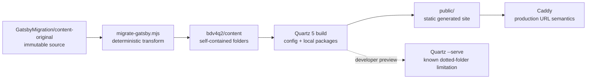
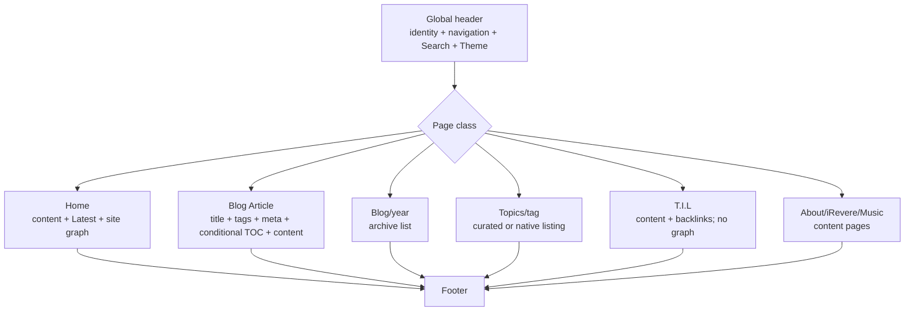
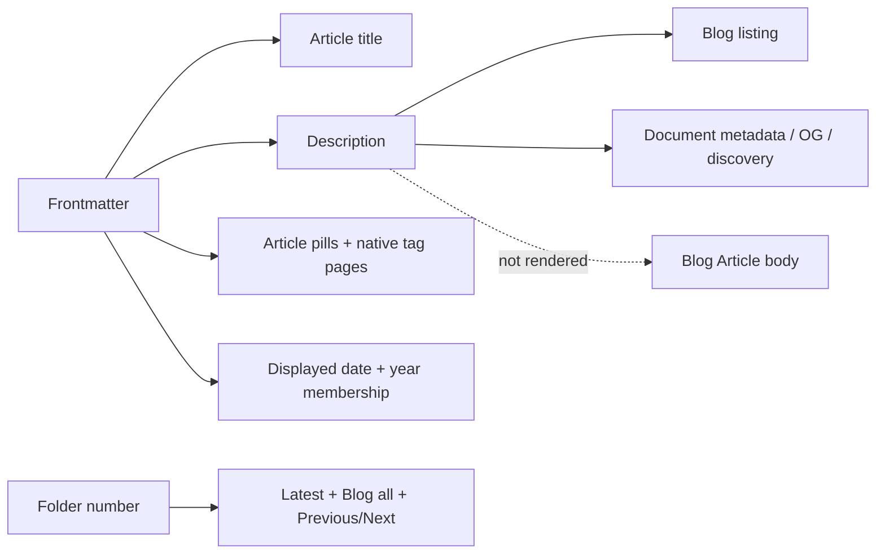

# bobbydreamer.xyz — Quartz Customizations

Quartz baseline: Quartz 5.0.0 at upstream commit `f1fba3f`  
Current Quartz version: 5.0.0 (no Quartz upgrade since the baseline)  
Baseline commit: `f1fba3fc55cbf60a60a5d09c95a49c042cdab63a`  
Site: `https://bobbydreamer.xyz`  
Last audited: 2026-09-24

This is the first document to read before changing or upgrading this site. It records the current repository state, why it differs from stock Quartz, which source files own each behavior, and how to prove that the behavior survived an upgrade. The repository is authoritative; historical phase reports explain intent and evolution.

## Authority and scope

The authorities, in descending order, are:

1. the current `bdv4q2` repository and its tests;
2. this document and `quartz-customizations.json`;
3. the current migration source, `GatsbyMigration/content-original`;
4. the Phase 0–4E.1 reports in `bdv4q2-codex-todo`;
5. `bdv4q1`, which is reference-only.

The audit verified the baseline from Git rather than accepting it from a handoff: branch `v5`, `HEAD`, `origin/v5`, and `upstream/v5` resolve to `f1fba3f`; `package.json` at that commit and now both report `5.0.0`; both remotes point to `https://github.com/jackyzha0/quartz.git`. The commit is not locally decorated with an exact tag.

Older reports remain useful history. Where a later phase superseded an earlier state, the later state below is authoritative: Explorer is removed; the identity is 3rem rather than the initially requested 4rem; the mobile page title is 2rem; and every Blog Article renders tag pills rather than Properties. Numeric sequence remains a separate chronology concern.

## Stock versus custom baseline

Git is the reliable comparison boundary:

```powershell
git diff --name-status f1fba3f
git ls-files --others --exclude-standard
```

Before this Phase 4F documentation was added, 288 of the 295 stock tracked paths were unchanged. Seven tracked paths differed and 682 paths were untracked; 645 of the untracked paths were the site content tree. There were 44 non-documentation path differences from stock, including the deleted empty content placeholder. Phase 4F adds this file and `quartz-customizations.json` but changes no runtime behavior.

### Categorized inventory

| Category                    | Current interpretation                                                                                                                                                                                          |
| --------------------------- | --------------------------------------------------------------------------------------------------------------------------------------------------------------------------------------------------------------- |
| Unchanged Quartz files      | 288/295 baseline tracked paths, including Quartz CLI, parsers, emitters, component registry implementation, page renderer, and server implementation.                                                           |
| Modified stock/config paths | `.prettierignore`, `package.json`, `package-lock.json`, `quartz.ts`, `quartz/styles/custom.scss`, `quartz/static/icon.png`; stock `content/.gitkeep` is deleted.                                                |
| New configuration/helpers   | `quartz.config.yaml`, `quartz.ia.ts`, `quartz.explorer-order.ts`. There is no `quartz.config.ts` or `quartz.layout.ts` in this Quartz 5 design.                                                                 |
| New local packages          | `quartz-ia-article-nav`, `quartz-ia-articles`, `quartz-ia-header`, `quartz-ia-pages`, and `quartz-ia-properties` (24 source/metadata/generated paths).                                                          |
| New scripts/tooling         | `scripts/migrate-gatsby.mjs`, `migrate-gatsby.test.mjs`, `validate-gatsby.mjs`, `audit-toc.mjs`, and generated `gatsby-migration-manifest.json`.                                                                |
| New tests                   | `quartz.explorer-order.test.ts`, `quartz.ia.test.ts`, and the migration test above. Stock Quartz tests remain unchanged.                                                                                        |
| Content architecture        | 155 Markdown documents in `content`: 153 migrated documents, the authored homepage, and one newly authored post; 150 numbered Blog Articles, four migrated static pages, and 491 source-owned colocated assets. |
| New static assets           | `quartz/static/brand/bobbydreamer-mark-source.png` and derived transparent `bobbydreamer-mark.png`; stock `quartz/static/icon.png` is replaced by the same derived image bytes.                                 |
| Serving/deployment          | New `Caddyfile`. The Dockerfile still starts Quartz preview rather than Caddy, but now invokes this repository's in-tree CLI to preserve one condition/component registry.                                      |
| Generated files             | `public/` is ignored build output. Eight local-package `dist/*.js` files are generated and are runtime package entry points. The migration manifest is generated evidence.                                      |
| Migration-only material     | `GatsbyMigration/*` lives outside `bdv4q2`. Only `content-original` is the current source; old Python tools and other corpus copies are historical.                                                             |
| Reports/documentation       | Phase reports and the blog draft live in `bdv4q2-codex-todo`, not in the production corpus.                                                                                                                     |

### Quartz-core policy

Quartz implementation-core modifications: **0**.

`quartz.ts` is the documented site bootstrap; `quartz/styles/custom.scss` is the site stylesheet hook; and `quartz/static/icon.png` is a replaceable static site asset. They are tracked stock paths, but changing these extension surfaces is not a patch to Quartz internals. Future work should continue to prefer configuration, supported registries, local packages, `custom.scss`, and migration tooling before considering a core patch. Any future edit to other files beneath `quartz/` must be called out explicitly as a core modification.

## Architecture at a glance







## Current snapshot and structural invariants

Snapshot counts describe the 2026-09-24 corpus and may legitimately increase when content is added. Structural invariants must continue to hold.

| Snapshot                                                    | Structural invariant                                                                                                                                                                  |
| ----------------------------------------------------------- | ------------------------------------------------------------------------------------------------------------------------------------------------------------------------------------- |
| 153 migrated documents: 149 posts + 4 pages                 | Every authoritative source document is emitted once; the homepage is separate authored content.                                                                                       |
| 491 source-owned assets                                     | Every source-owned asset is copied byte-for-byte beside its owning document; additions change the count.                                                                              |
| 153 historical URLs: 128 canonical matches + 25 aliases     | Every historical Gatsby URL resolves to the intended canonical document with no collision or self-redirect.                                                                           |
| 150 Blog titles, dates, and rendered descriptions           | Every sequence-bearing production article appears exactly once in Blog with title, date, and a description (148 are explicit frontmatter descriptions; Quartz derives the other two). |
| 150 article tag lists; all current articles have tags       | Tagged Blog Articles render every linked pill below the title; an untagged article renders no container or gap.                                                                       |
| 0 Properties panels; 0 article description rows             | Blog Article bodies never repeat discovery descriptions or render Properties.                                                                                                         |
| 54 expected and 54 rendered TOCs                            | Every Blog Article with at least two eligible H1–H3 headings renders a TOC; no ineligible article does.                                                                               |
| 0 numeric tag routes                                        | Prose ordinals such as `#1` never become taxonomy.                                                                                                                                    |
| 0 Spotify runtime embeds                                    | Historical prose/code may mention Spotify, but no executable component or iframe is emitted.                                                                                          |
| 0 migration errors / broken generated references            | Migration and generated-site validators remain green.                                                                                                                                 |
| 0 LaTeX/KaTeX warnings                                      | Known currency prose remains escaped at the migration boundary.                                                                                                                       |
| 0 browser console errors / 0 page-level horizontal overflow | Representative page classes remain clean at 1440×900, 900×900, and 390×844 in both themes.                                                                                            |

The four expected Git-date warnings for untracked `bio`, `irevere`, `music`, and `til` are a repository-state warning, not a content or rendering failure. Date priority is frontmatter, then Git, then filesystem.

## Customization catalogue

The IDs below are stable. The concise machine index is `quartz-customizations.json`.

| ID          | Name                                                         | Category                 | Risk   |
| ----------- | ------------------------------------------------------------ | ------------------------ | ------ |
| QZ-CUST-001 | Migration corpus ownership and deterministic pipeline        | migration                | MEDIUM |
| QZ-CUST-002 | MDX/content transformations and repair ledger                | migration                | MEDIUM |
| QZ-CUST-003 | Canonical paths, aliases, and compatibility redirects        | routing                  | HIGH   |
| QZ-CUST-004 | Caddy production URL semantics                               | deployment               | HIGH   |
| QZ-CUST-005 | Numeric chronology and calendar-date separation              | information architecture | MEDIUM |
| QZ-CUST-006 | Page classification and conditional composition              | information architecture | HIGH   |
| QZ-CUST-007 | Site identity, navigation, Search, and Theme header          | component                | MEDIUM |
| QZ-CUST-008 | Homepage, Working on, and Latest Articles                    | information architecture | MEDIUM |
| QZ-CUST-009 | Blog and year archives                                       | component/page type      | HIGH   |
| QZ-CUST-010 | Topics, native tags, and taxonomy guard                      | taxonomy                 | MEDIUM |
| QZ-CUST-011 | Numeric Previous/Next navigation                             | component                | MEDIUM |
| QZ-CUST-012 | Numbered-article metadata composition                        | component                | HIGH   |
| QZ-CUST-013 | Numbered-article TOC rule                                    | component/configuration  | MEDIUM |
| QZ-CUST-014 | Homepage site-wide Graph View                                | component/configuration  | MEDIUM |
| QZ-CUST-015 | Brand mark, wordmark, and favicon                            | branding                 | LOW    |
| QZ-CUST-016 | Typography, natural title wrapping, and responsive layout    | styling                  | MEDIUM |
| QZ-CUST-017 | Visual tokens and content presentation                       | styling                  | MEDIUM |
| QZ-CUST-018 | Intentional removals and content-compatibility configuration | configuration            | LOW    |
| QZ-CUST-019 | Local-package source and generated-artifact lifecycle        | build architecture       | HIGH   |

### QZ-CUST-001 — Migration corpus ownership and deterministic pipeline

- **Purpose / user requirement:** migrate the entire Gatsby corpus without flattening folders, losing assets, or mutating the historical source.
- **Stock Quartz behavior:** Quartz consumes Markdown already placed in `content`; it does not understand this Gatsby corpus or establish its provenance.
- **bobbydreamer behavior:** `content-original` is read-only input; each source document becomes `content/<source-folder>/index.md`; owned assets remain beside it; reruns are byte-for-byte deterministic and replace only migration-owned destination folders.
- **Implementation location:** `scripts/migrate-gatsby.mjs`, `scripts/gatsby-migration-manifest.json`, and `content/`.
- **Configuration involved:** the script defaults to `../GatsbyMigration/content-original`, `content`, and the manifest path; no Quartz-core setting.
- **Components/CSS involved:** none.
- **Scripts involved:** migrator is authoritative; `validate-gatsby.mjs` is validation-only; `migrate-gatsby.test.mjs` proves preflight, determinism, and source immutability.
- **Tests protecting it:** “full corpus preflight…”, “complete link graph…”, and “full migration reruns byte-for-byte and leaves source immutable”.
- **Content/data dependencies:** current source snapshot is 149 post folders, 4 page folders, 153 documents, 491 owned assets, plus two retained component source files that are not counted as site assets.
- **Routes affected:** every migrated canonical and alias.
- **Responsive implications:** none.
- **Upgrade risk:** **MEDIUM** because output frontmatter and link semantics depend on installed Quartz transformer behavior, although the pipeline does not import Quartz core implementation files.
- **Can newer native Quartz replace it?** Only if a future supported importer proves identical folder, asset, alias, repair, and determinism behavior. Do not replace on feature-name similarity.
- **How to validate after upgrade:** migration check, migration tests, generated validator, source hash snapshot, and snapshot/structural counts.
- **Historical authority:** Representative PoC and Full Content Migration reports.

### QZ-CUST-002 — MDX/content transformations and repair ledger

- **Purpose / user requirement:** make authored Gatsby MDX safe for Quartz Markdown while preserving visible prose and keeping every exception explicit.
- **Stock Quartz behavior:** it parses the supplied Markdown; it does not apply corpus-specific repairs.
- **bobbydreamer behavior:** transforms frontmatter, removes executable Spotify components, normalizes one `react-live` fence and three tables, preserves exact asset casing, handles three unavailable/misnamed images, applies six explicit repairs, escapes eight angle-bracket prose cases, repairs seven malformed links, escapes 27 numeric ordinals, and escapes 139 currency-dollar markers in six traced documents.
- **Implementation location:** `migrationExceptions`, `transformFrontmatter`, `transformDocument`, and helper functions in `scripts/migrate-gatsby.mjs`.
- **Configuration/components/CSS:** frontmatter fields feed Quartz plugins; no component or CSS performs these repairs.
- **Scripts involved:** migrator, migration tests, generated validator, and manifest transformation counts.
- **Tests protecting it:** named tests cover frontmatter/aliases, Spotify, ordinals, currency, `react-live`, tables, asset case, missing assets, duplicate basenames, unknown components, collisions, and deterministic full reruns.
- **Content/data dependencies:** exception keys are exact paths beneath `content-original`; fenced and inline code must remain untouched.
- **Routes affected:** alias generation and repaired internal links; content routes themselves are not renamed.
- **Responsive implications:** none.
- **Upgrade risk:** **MEDIUM** because parsing changes in Obsidian Markdown, KaTeX, or link resolution may make a repair obsolete or reveal a new case.
- **Can newer native Quartz replace it?** Individual repairs may become unnecessary, but remove one only after its source pattern and regression test prove the native behavior is equivalent.
- **How to validate after upgrade:** run all migration tests/checks, compare manifest transformation totals, build with zero KaTeX warnings, and verify zero numeric routes/Spotify embeds.
- **Historical authority:** PoC, Full Migration, Visual Design, and Phase 4B reports.

### QZ-CUST-003 — Canonical paths, aliases, and compatibility redirects

- **Purpose / user requirement:** preserve all Gatsby URLs, numbered/dotted canonical folders, and selected Quartz 4 page URLs.
- **Stock Quartz behavior:** canonical URLs follow content paths; the alias plugin emits redirect HTML, but it does not invent corpus aliases or Quartz 4 mappings.
- **bobbydreamer behavior:** 128 historical slugs exactly match path-derived canonicals; 25 differing Gatsby slugs become frontmatter aliases; `pages/about_me`, `pages/irevere`, and `pages/til` are emitted as compatibility redirects.
- **Implementation location:** `transformFrontmatter` and manifest; `quartz.ia.ts` compatibility map; `quartz-ia-pages/index.tsx` emitter; `@quartz-community/alias-redirects` config.
- **Configuration involved:** alias redirects and local IA page plugin enabled.
- **Components/CSS involved:** none.
- **Scripts involved:** collision/link audit and generated validator.
- **Tests protecting it:** migration route-collision tests, generated canonical/alias checks, and the Quartz 4 compatibility map test.
- **Content/data dependencies:** `aliases` exists only when normalized Gatsby slug differs from the destination; physical `19.` and `20.` dotted directories are retained.
- **Routes affected:** all 153 historical routes, 25 aliases, three Quartz 4 page routes, especially `/19.changing-gatsby-colors-manually/` and `/20.gatsby-theme-features/`.
- **Responsive implications:** none.
- **Upgrade risk:** **HIGH** because correctness spans the alias plugin, local emitter contract, relative meta-refresh output, static filenames, and production server lookup.
- **Can newer native Quartz replace it?** A native compatibility emitter may replace local emission only if it preserves these exact files/targets and Caddy behavior.
- **How to validate after upgrade:** migration validator plus the canonical/alias/Caddy route matrix, including dotted assets, slashless/slashed aliases, and query preservation.
- **Historical authority:** Full Migration and Routing Closure reports.

### QZ-CUST-004 — Caddy production URL semantics

- **Purpose / user requirement:** serve static Quartz output with canonical trailing slashes, clean URLs, alias redirects, dotted directories, assets, and query strings.
- **Stock Quartz behavior:** Quartz preview uses `serve-handler`; in this baseline it returns 404 for clean dotted directory URLs. Running bare `npx quartz` from this workspace can also download a second Quartz package root and must not be used.
- **bobbydreamer behavior:** Caddy checks for real alias `.html` files before stripping a trailing slash, enforces a slash for real directory indexes, and then tries `{path}`, `{path}.html`, and `{path}/index.html`.
- **Implementation location:** `Caddyfile` owns production semantics. The current `Dockerfile` still runs preview and is not production-Caddy integration; its command deliberately calls `node ./quartz/bootstrap-cli.mjs` so preview uses the repository runtime.
- **Configuration/components/CSS/scripts:** `QUARTZ_ROOT` defaults to `/srv`; no Quartz component or migration script owns server behavior.
- **Tests protecting it:** no automated repository test. Historical Caddy 2.7.6 route-matrix evidence is in the Routing Closure report.
- **Content/data dependencies:** generated canonical directory indexes and alias `.html` files.
- **Routes affected:** all routes; dotted canonicals and trailing-slash aliases are the critical cases.
- **Responsive implications:** none.
- **Upgrade risk:** **HIGH** because static emitter filenames, alias markup, Caddy matchers, and eventual container wiring must agree.
- **Can newer native Quartz replace it?** A future production server can replace Caddy only after it passes the same matrix. Quartz preview behavior is not production authority.
- **How to validate after upgrade:** `caddy validate`, run against `public`, then check root, canonical folders, slash normalization, aliases, dotted indexes/assets, 404s, and query-preserving `Location` headers.
- **Historical authority:** Routing Closure report.

### QZ-CUST-005 — Numeric chronology and calendar-date separation

- **Purpose / user requirement:** preserve the intentional leading-number publication sequence even though source dates materially diverge.
- **Stock Quartz behavior:** listings commonly use dates or lexical paths.
- **bobbydreamer behavior:** leading numbers (dashed or dotted) control Latest, the all-articles Blog list, and Previous/Next. Frontmatter dates control displayed publication dates and year membership; within a year, articles are date-descending with numeric order as a tie-breaker.
- **Implementation location:** `quartz.explorer-order.ts`, `quartz.ia.ts`, Recent Notes overrides in `quartz.ts`, archive and navigation local packages.
- **Configuration/components/CSS/scripts:** Recent Notes config; Blog/year and Article Sequence components; archive/navigation styling; no migration rewrite.
- **Tests protecting it:** three comparator tests plus IA tests for Latest, years, and neighbors.
- **Content/data dependencies:** production post folders begin with a number and `-` or `.`; all 150 current articles have frontmatter dates. The historical migrated-corpus audit found 25 adjacent reversals and 1,196 pair inversions between numeric and date ordering.
- **Routes affected:** `/`, `/blog/`, `/blog/<year>/`, and every numbered article.
- **Responsive implications:** Previous/Next changes from two columns to one at 800px; chronology does not change.
- **Upgrade risk:** **MEDIUM** because several components must continue using the same comparator rather than new native date defaults.
- **Can newer native Quartz replace it?** Only if upstream exposes the same structural comparator and year/date split.
- **How to validate after upgrade:** comparator/IA tests and representative beginning/middle/end neighbor and Blog/year checks.
- **Historical authority:** Routing Closure and IA Homepage Navigation reports.

### QZ-CUST-006 — Page classification and conditional composition

- **Purpose / user requirement:** apply components to meaningful site page classes rather than every Quartz page.
- **Stock Quartz behavior:** default layouts expose generic page types and broadly registered components.
- **bobbydreamer behavior:** local classes are `home`, `article`, `til`, `static`, `archive`, `topic`, and `other`. A Blog Article is dated authored content outside reserved non-article routes; its numeric prefix is not its presentation classifier. Custom conditions place title/meta/TOC/backlinks/graph/navigation appropriately.
- **Implementation location:** `classifyPage` in `quartz.ia.ts`; `registerCondition` calls in `quartz.ts`; local page-type plugins and `quartz.config.yaml` layout registrations.
- **Configuration involved:** `home-page`, `not-home-page`, `blog-article`, `numbered-article`, `article-or-til`, and `never-render` conditions. `blog-article` controls article composition; `numbered-article` remains only where sequence is required. Right rails are empty on folder/tag/archive classes.
- **Components involved:** all five local packages plus native Article Title, Content Meta, TOC, Backlinks, Graph, Search, Darkmode, Breadcrumbs, and Footer.
- **CSS/scripts:** page/grid selectors in `custom.scss`; no migration script.
- **Tests protecting it:** page-class, legacy/future Blog Article matcher, classification/chronology separation, and configuration-composition tests.
- **Content/data dependencies:** a valid frontmatter publication date identifies authored Blog content after reserved home, `til`, `bio`, `irevere`, `music`, `blog`, `topics`, and `tags` routes are excluded. Production chronology additionally requires the numbered folder convention.
- **Routes affected:** every rendered page class.
- **Responsive implications:** page grid/right rail collapses at Quartz tablet/mobile breakpoints.
- **Upgrade risk:** **HIGH** because it uses Quartz loader condition registration, page-type plugin contracts, registry layout names, and internal page data shapes.
- **Can newer native Quartz replace it?** Native conditional layouts/page-type generation are candidates if they can express the exact matrix.
- **How to validate after upgrade:** classification tests plus one generated/browser sample for every page class.
- **Historical authority:** IA Homepage Navigation through Phase 4E.1.

### QZ-CUST-007 — Site identity, navigation, Search, and Theme header

- **Purpose / user requirement:** one coherent header with identity and primary links `Blog`, `Topics`, `T.I.L`, `iRevere`, and `About`, plus native Search and Theme controls.
- **Stock Quartz behavior:** Page Title, Search, and Darkmode live in the left sidebar; no Bobby-specific route-aware navigation exists.
- **bobbydreamer behavior:** custom identity/navigation is header priority 10, Search 20, Theme 30. Topics is active on native tag routes. Navigation wraps below the identity when width requires and is deliberately below it on mobile.
- **Implementation location:** `quartz-ia-header/components.tsx`, `style.ts`, config, and header sections of `custom.scss`.
- **Configuration/components/CSS:** local SiteNavigation; native Search and Darkmode; token-backed sizes and responsive flex rules.
- **Scripts involved:** none.
- **Tests protecting it:** brand-reference and exact-typography tests; browser validation is manual.
- **Content/data dependencies:** canonical top-level routes and brand asset.
- **Routes affected:** all pages.
- **Responsive implications:** same row at 1440px; navigation below/wrapped at 900px; column layout at the 800px mobile breakpoint; controls remain on their own header row.
- **Upgrade risk:** **MEDIUM** because the local component uses supported-like component APIs but styling depends on Quartz header markup and component ordering.
- **Can newer native Quartz replace it?** Evaluate a future native navigation component, but retain route labels, active logic, ordering, and responsive placement.
- **How to validate after upgrade:** test all links/active states, Search/Theme interaction, identity alignment, collisions, clipping, console, and overflow at the three reference widths/themes.
- **Historical authority:** IA Homepage Navigation, Visual Design, and Phase 4D.

### QZ-CUST-008 — Homepage, Working on, and Latest Articles

- **Purpose / user requirement:** keep the authored introduction and project links while showing the seven latest numbered articles by numeric sequence.
- **Stock Quartz behavior:** generic Content Page; Recent Notes is disabled by default and date-oriented if enabled without overrides.
- **bobbydreamer behavior:** semantic H1 greeting, authored `Working on` list, desktop-only Latest Articles in the left rail, and no Explorer.
- **Implementation location:** `content/index.md`; Recent Notes option override in `quartz.ts`; config and homepage/recent-note CSS.
- **Configuration/components/CSS:** Recent Notes is filtered to numbered articles, sorted numerically, limited to seven, linked to Blog, and hides tags; homepage selectors style the greeting and project grid.
- **Scripts involved:** none.
- **Tests protecting it:** semantic-H1, numeric Latest, and Explorer-removal tests.
- **Content/data dependencies:** `# Hello, i am Sushanth.` and `## Working on` IDs generated by Markdown headings.
- **Routes affected:** `/` and `/blog/` link.
- **Responsive implications:** Working on changes from two columns to one on mobile; Latest is desktop-only.
- **Upgrade risk:** **MEDIUM** because Recent Notes function overrides use `componentRegistry.setOptionOverrides` and CSS targets its generated structure.
- **Can newer native Quartz replace it?** A native configurable recent-post list may replace the registry override if it supports numeric filtering/sorting.
- **How to validate after upgrade:** homepage H1, seven-item order, Blog link, Working on order/layout, and no Explorer.
- **Historical authority:** IA Homepage Navigation through Phase 4C.

### QZ-CUST-009 — Blog and year archives

- **Purpose / user requirement:** expose all numbered articles and year views without moving physical content into year folders.
- **Stock Quartz behavior:** folder/tag pages do not provide this combined virtual Blog/year archive behavior.
- **bobbydreamer behavior:** `/blog/` lists all 150 current sequence-bearing articles in numeric sequence with title, date, and description. `/blog/<year>/` pages are generated from frontmatter dates, use date-descending order, and share the same title/component/visual treatment.
- **Implementation location:** `quartz-ia-pages/index.tsx` and `style.ts`; archive helpers in `quartz.ia.ts`; archive CSS in `custom.scss`.
- **Configuration involved:** local page/emitter plugin order 45; archive right rail empty.
- **Components involved:** one `ArchiveBody` handles Blog, years, and Topics branch.
- **Scripts involved:** descriptions are supplied by Quartz's Description transformer after migration preserves frontmatter/prose.
- **Tests protecting it:** year semantics, shared Blog/year-component tests, and the Blog-description-versus-article-composition regression. Generated output currently proves 150 titles/dates/descriptions.
- **Content/data dependencies:** 150 numbered slugs/dates; 148 explicit frontmatter descriptions and two Quartz-derived descriptions.
- **Routes affected:** `/blog/` and currently `/blog/2018/`, `/2020/`, `/2021/`, `/2022/`, `/2023/`, `/2026/`; future years derive automatically.
- **Responsive implications:** desktop rows use title/date columns; mobile rows stack; year navigation becomes non-sticky.
- **Upgrade risk:** **HIGH** because the local package implements Quartz page-type generation and emission with internal types/data and a cast across the plugin API.
- **Can newer native Quartz replace it?** A native archive plugin is a strong candidate only if it preserves the chronology/date split and descriptions.
- **How to validate after upgrade:** structural one-entry-per-sequence-bearing-article audit, all/year order, year membership, current title/date/description counts, light/dark responsive rendering.
- **Historical authority:** IA Homepage Navigation, Phase 4B, and Phase 4E.

### QZ-CUST-010 — Topics, native tags, and taxonomy guard

- **Purpose / user requirement:** offer a curated discovery entrance without replacing Quartz's complete tag index or per-tag pages.
- **Stock Quartz behavior:** native `/tags/` index and tag pages expose all tags.
- **bobbydreamer behavior:** `/topics/` shows eleven curated tags only when present, links to native `/tags/<slug>`, and links onward to all tags. Article pills and native tag listings remain native link destinations. Prose `#1`–`#5` cannot create numeric routes.
- **Implementation location:** curated list/Topics branch in `quartz-ia-pages/index.tsx`; native Tag Page plugin; article Tag List wrapper; numeric ordinal transform/test/validator.
- **Configuration/components/CSS:** Topics uses archive page class; native Tag Page remains enabled; topic cards, article pills, and page-listing tags are styled in `custom.scss`.
- **Scripts involved:** migration escapes only 27 traced ordinals in post 90; validator rejects numeric tag routes.
- **Tests protecting it:** ordinal unit/corpus tests, generated numeric-route guard, and Phase 4E Tag List rendering tests.
- **Content/data dependencies:** curated slugs are `quest-for-wealth`, `notes`, `web-development`, `gcp`, `python`, `nodejs`, `personal-development`, `gatsbyjs`, `firebase`, `javascript`, and `pandas`.
- **Routes affected:** `/topics/`, `/tags/`, and `/tags/<slug>`.
- **Responsive implications:** curated topics are two columns, one on mobile; tag pills wrap.
- **Upgrade risk:** **MEDIUM** because native tag markup/slug behavior and `parseTags: true` are dependencies.
- **Can newer native Quartz replace it?** A configurable curated Topics page could replace the local branch; never remove the numeric-taxonomy guard without proving parser behavior.
- **How to validate after upgrade:** curated links, native index/tag pages, article/listing pills, and zero `/tags/1` through `/tags/5` routes.
- **Historical authority:** IA Homepage Navigation, Phase 4B, and Phase 4E.

### QZ-CUST-011 — Numeric Previous/Next navigation

- **Purpose / user requirement:** navigate the structural article sequence, including gaps and duplicate numeric prefixes.
- **Stock Quartz behavior:** no previous/next component implementing this corpus order.
- **bobbydreamer behavior:** Previous means the next lower position in numeric-descending order; Next means the higher position. Boundaries omit the unavailable side.
- **Implementation location:** neighbor logic in `quartz.ia.ts`; component/style/package in `quartz-ia-article-nav`; numbered-only `afterBody` registration.
- **Configuration/components/CSS:** local component at priority 10; local CSS plus shared surface tokens.
- **Scripts involved:** none.
- **Tests protecting it:** neighbor test covers gaps, duplicate sequences, non-articles, and boundaries; comparator tests cover dotted names.
- **Content/data dependencies:** numbered canonical slugs and titles.
- **Routes affected:** every numbered article only.
- **Responsive implications:** two cards become one column at 800px.
- **Upgrade risk:** **MEDIUM** because it consumes Quartz component props and `resolveRelative`, but order logic is isolated.
- **Can newer native Quartz replace it?** Yes if a future component accepts this comparator and boundary semantics.
- **How to validate after upgrade:** first/middle/duplicate/last article links and mobile layout.
- **Historical authority:** IA Homepage Navigation report.

### QZ-CUST-012 — Blog Article metadata composition

- **Purpose / user requirement:** render title, linked tag pills, date/read time, separator, then content; omit Properties and the duplicated article description while preserving discovery metadata.
- **Stock Quartz behavior:** Note Properties can show description/tags; Tag List can be registered directly.
- **bobbydreamer behavior:** native Note Properties is forced to `never-render`; local `@bdv/quartz-ia-properties` wraps native `TagList` at beforeBody priority 15, before Content Meta at 20. Both are conditioned on the semantic `blog-article` class. Empty tags return no markup. Descriptions remain available to Blog, metadata, OG, and discovery but not the article header/body.
- **Implementation location:** `quartz-ia-properties`, config, article tag CSS, and Description plugin.
- **Configuration/components/CSS:** local ArticleTags wrapper, native Tag List disabled as a direct registration, native Content Meta and TOC conditioned on `blog-article`.
- **Scripts involved:** migrator preserves `description` and `tags`; it does not rewrite frontmatter for presentation.
- **Tests protecting it:** legacy/future page-type equivalence, config/order, Blog description separation, and empty/one/multiple linked-tag rendering tests. Generated/browser audits cover all 150 current Blog Articles.
- **Content/data dependencies:** all current Blog Articles have at least one tag; the no-tags behavior is component-tested.
- **Routes affected:** Blog Articles, tag targets, and Blog metadata consumers. Numeric Previous/Next remains limited to sequence-bearing articles.
- **Responsive implications:** pills wrap naturally; no empty gap; content order is unchanged across breakpoints.
- **Upgrade risk:** **HIGH** because direct registration of `@quartz-community/tag-list` in this baseline caused the component registry to replace Theme with an extra tag list. The wrapper is an intentional workaround for a registry/identity quirk.
- **Can newer native Quartz replace it?** Re-test direct native registration after an upgrade. Replace the wrapper only if Search/Theme and component identity remain correct.
- **How to validate after upgrade:** no Properties/description rows, title→tags→meta order, empty/one/many tags, working tag links, Blog descriptions, Search/Theme singleton counts.
- **Historical authority:** Phase 4C evolution and authoritative Phase 4E/4E.1 reports.

### QZ-CUST-013 — Blog Article TOC rule

- **Purpose / user requirement:** show useful TOCs on substantive Blog Articles without trivial/empty panels elsewhere.
- **Stock Quartz behavior:** baseline TOC default `maxDepth: 3`, `minEntries: 1`; implementation renders only when `toc.length > minEntries`.
- **bobbydreamer behavior:** H1–H3 qualify, H4–H6 do not; effective minimum is therefore two qualifying headings; only Blog Articles register the right-rail TOC.
- **Implementation location:** native TOC plugin/config plus `blog-article` condition; `scripts/audit-toc.mjs` discovers dated Blog Articles independently of migration-manifest membership.
- **Configuration/components/CSS:** right priority 30; TOC surface and in-view styles in `custom.scss`.
- **Scripts involved:** audit parses Markdown headings and compares expected to generated HTML.
- **Tests protecting it:** persistent TOC audit, currently 150 Blog Articles / 54 expected / 54 rendered / 0 mismatches. No unit test pins the upstream strict-`>` implementation.
- **Content/data dependencies:** Markdown heading depths and optional `enableToc: false`.
- **Routes affected:** Blog Articles only.
- **Responsive implications:** Quartz moves/hides right-rail composition according to its layout; never force a trivial mobile TOC.
- **Upgrade risk:** **MEDIUM** because a native default/comparison change can silently change the effective threshold.
- **Can newer native Quartz replace it?** It already uses native Quartz; local configuration/audit must remain.
- **How to validate after upgrade:** run the audit and inspect TOC/no-TOC article samples at all reference widths.
- **Historical authority:** Phase 4C report and TOC Audit.

### QZ-CUST-014 — Homepage site-wide Graph View

- **Purpose / user requirement:** place a useful site-wide graph after `Working on`; remove the useless one-node T.I.L graph.
- **Stock Quartz behavior:** default Graph is a local right-rail graph.
- **bobbydreamer behavior:** native Graph is homepage `afterBody`, depth `-1`, tags enabled, with drag/zoom and tuned forces; T.I.L has no Graph. The current generated semantic count is 220 nodes, 210 resolvable content links (202 non-home plus eight authored homepage links), and 310 tag links: 520 total relationships. The Phase 4C snapshot recorded 220 nodes and 512 edges using the non-home content-edge baseline; future audits should state whether homepage-authored links are included rather than comparing ambiguous totals.
- **Implementation location:** graph config and graph/homepage CSS; native `@quartz-community/graph` implementation.
- **Configuration involved:** drag/zoom true, scale 0.8, repel 0.6, center 0.25, distance 35, font 0.55, opacity 0.9, focus hover true, radial false.
- **Components/CSS/scripts:** native Graph; homepage width/height rules and theme tokens; no dedicated graph audit script.
- **Tests protecting it:** config/placement test. Node/edge counts and canvas interactions are manual/generated-data audits.
- **Content/data dependencies:** `contentIndex.json`, resolved links, and tags. T.I.L has no graph-resolvable links/tags.
- **Routes affected:** `/` only; explicitly not `/til/`.
- **Responsive implications:** graph height is `clamp(20rem, 36vw, 24rem)` and 18rem on mobile; width is bounded by the wide content width; shadow is removed on mobile.
- **Upgrade risk:** **MEDIUM** because data normalization, native canvas markup, CDN-loaded D3/Pixi, and generated class names may change.
- **Can newer native Quartz replace it?** It already reuses native Graph; retain only config/CSS while adapting to upstream APIs.
- **How to validate after upgrade:** homepage placement after authored content, T.I.L absence, data metrics with a documented counting rule, canvas/render/drag/zoom/theme, CDN errors, and overflow.
- **Historical authority:** Phase 4C report.

### QZ-CUST-015 — Brand mark, wordmark, and favicon

- **Purpose / user requirement:** show the geometric mark with `bobby_dreamer` as one identity and use it as favicon.
- **Stock Quartz behavior:** generic page title and icon.
- **bobbydreamer behavior:** repository-owned source mark produces a transparent runtime mark and favicon; wordmark uses IBM Plex Mono; mark is 0.75em of identity and inverts in dark mode.
- **Implementation location:** `quartz/static/brand/*`, `quartz/static/icon.png`, header component/style, and Favicon plugin.
- **Configuration/components/CSS:** site page title/suffix and favicon plugin; local identity markup/CSS.
- **Scripts involved:** no committed generator; the derived mark and icon are byte-identical SHA-256 `a187efc1…955d45`. Preserve the source PNG (`c3f73fc4…12f06`) for future regeneration.
- **Tests protecting it:** source-reference test and generated validator checks for mark/favicon references on representative pages.
- **Content/data dependencies:** none.
- **Routes affected:** every page and root favicon.
- **Responsive implications:** identity is 3rem desktop/tablet, 2rem mobile; mark follows proportionally.
- **Upgrade risk:** **LOW** because this is assets, config, and local markup; only emitted static paths need review.
- **Can newer native Quartz replace it?** Native branding may replace wiring, not the brand assets or selected treatment.
- **How to validate after upgrade:** emitted files, header image URL, favicon link, dark inversion, alignment, and sizes.
- **Historical authority:** Visual Design, Phase 4B, and Phase 4D.

### QZ-CUST-016 — Typography, natural title wrapping, and responsive layout

- **Purpose / user requirement:** preserve exact selected sizes and allow titles to wrap only when real available width requires it.
- **Stock Quartz behavior:** generic heading/identity defaults and prior `.article-title` styling did not encode these tokens; an earlier local `max-width: 21ch` caused premature wrapping.
- **bobbydreamer behavior:** normal title 2.5rem desktop/tablet and 2rem mobile; navigation 1.2rem; homepage greeting 1.7rem and semantic H1; identity 3rem desktop/tablet and 2rem mobile. `.article-title` has no `max-width`, `max-inline-size`, `nowrap`, or shrink-to-fit rule.
- **Implementation location:** typography variables/dedicated selectors in `custom.scss` and token consumption in `quartz-ia-header/style.ts`; theme fonts in config.
- **Configuration/components/CSS:** Schibsted Grotesk for title/header, Source Sans Pro body, IBM Plex Mono code/wordmark; generic content H1–H4 rules must not override dedicated classes/ID.
- **Scripts involved:** none.
- **Tests protecting it:** exact-token and no-artificial-title-maximum test; browser computed-size/wrapping matrix is manual.
- **Content/data dependencies:** article titles, especially “Calling NodeJS Functions from external files”.
- **Routes affected:** all page titles/header; homepage greeting exception.
- **Responsive implications:** `$mobile` (Quartz 800px boundary) changes only title/identity tokens; header and grid also reflow. Reference widths are 1440, 900, and 390px.
- **Upgrade risk:** **MEDIUM** because cascade specificity, Quartz breakpoints/grid, generated title class, and header DOM can alter computed results.
- **Can newer native Quartz replace it?** Native tokens are suitable only if they express these exact values and natural wrapping.
- **How to validate after upgrade:** computed sizes, element/containing widths, `max-*` values, line counts for short/long/TOC/no-TOC titles, clipping/collision/overflow in both themes.
- **Historical authority:** Phase 4D including its post-completion wrapping correction.

### QZ-CUST-017 — Visual tokens and content presentation

- **Purpose / user requirement:** provide a coherent warm light/charcoal dark visual system across reading, archive, discovery, controls, and media.
- **Stock Quartz behavior:** default palette and component presentation.
- **bobbydreamer behavior:** custom colors, surfaces, borders, radii, shadows, focus ring, spacing, reading/wide widths, long-form typography, cards, tables, media, callouts, TOC/backlinks/graph, search, archive, tag listing, and reduced motion.
- **Implementation location:** theme colors/fonts in config; `quartz/styles/custom.scss`; small package-local styles for header/archive/navigation.
- **Configuration/components/CSS:** see the token and CSS maps below; no runtime styling script.
- **Scripts involved:** none.
- **Tests protecting it:** selected typography/composition assertions; most visual details have browser evidence but no screenshot regression suite.
- **Content/data dependencies:** generated heading IDs, article/listing/tag markup, rich media/tables/callouts.
- **Routes affected:** site-wide.
- **Responsive implications:** tablet and mobile grid, header, archives, topics, metadata, media, and reading aids have explicit rules.
- **Upgrade risk:** **MEDIUM** because many selectors couple to Quartz classes, DOM nesting, `data-slug`, and `:has()` relationships.
- **Can newer native Quartz replace it?** Individual rules may be retired when native output exactly matches; tokens and selected visual identity remain authoritative.
- **How to validate after upgrade:** representative page-class browser matrix, focus/reduced motion, light/dark colors, media/tables/code, console, and horizontal overflow.
- **Historical authority:** Visual Design through Phase 4E.

### QZ-CUST-018 — Intentional removals and content-compatibility configuration

- **Purpose / user requirement:** retain useful native content support while excluding unwanted or misleading UI/runtime behavior.
- **Stock Quartz behavior:** Explorer and Page Title are enabled; Reader Mode is enabled; hard line breaks are disabled; Graph is right-rail; Spotify is outside stock Quartz but existed in Gatsby MDX.
- **bobbydreamer behavior:** Explorer, Page Title, Reader Mode, Spacer, direct Tag List, and visible Note Properties are disabled/removed; Cheats navigation was rejected; Spotify runtime is removed. Obsidian Markdown features, GFM, hard breaks, KaTeX, syntax highlighting, Excalidraw, aliases, content index, and native tag/folder/content pages remain enabled.
- **Implementation location:** `quartz.config.yaml`, dependency list, migration Spotify transform, and absence of Explorer/Cheats registrations.
- **Configuration/components/CSS:** config-only except migration suppression; obsolete `.note-properties` CSS remains harmless legacy styling and is not active composition.
- **Scripts involved:** Spotify transform/tests/validator and currency warning repair under QZ-CUST-002.
- **Tests protecting it:** Explorer removal, Spotify unit/corpus/generated guards, numeric route and build-warning validation.
- **Content/data dependencies:** historical Spotify prose/fenced code remains; four executable component instances are removed.
- **Routes affected:** all layout pages; no Cheats route is introduced.
- **Responsive implications:** removing Explorer is essential to the current content-first layout.
- **Upgrade risk:** **LOW** because most choices are explicit plugin enablement, though defaults must be rechecked on upgrade.
- **Can newer native Quartz replace it?** Re-evaluate each disabled feature deliberately; do not silently re-enable because defaults changed.
- **How to validate after upgrade:** config inventory, no Explorer/Properties/Spotify, required parsers/build samples, and header/page-class checks.
- **Historical authority:** IA reports, Visual Design, and Phase 4B–4E.

### QZ-CUST-019 — Local-package source and generated-artifact lifecycle

- **Purpose / user requirement:** extend Quartz without forking core while remaining installable through Quartz 5's package/plugin loader.
- **Stock Quartz behavior:** consumes community packages from `node_modules`; it has no `@bdv/*` packages.
- **bobbydreamer behavior:** five local `file:` dependencies expose generated ESM from `dist`, while TypeScript/TSX beside each package is the only edit authority.
- **Implementation location:** five `quartz-ia-*` directories, their `package.json` files, root dependencies/lock, and generated `dist` files.
- **Configuration/components/CSS:** registered by package source names in YAML; package metadata declares component/pageType/emitter categories.
- **Scripts involved:** each package has an esbuild `build` script. Root `prebuild` installs plugins; `build`, `serve`, `docs`, and `quartz` invoke `node ./quartz/bootstrap-cli.mjs` directly. Local dependencies are junctions in this audited Windows workspace.
- **Tests protecting it:** the launch-command regression rejects `npx quartz` in package scripts/Dockerfile and requires the in-tree CLI. No committed source-vs-dist parity test exists; Phase 4F rebuilt every entry into a temporary directory and all eight outputs matched checked-in `dist` after CRLF/LF normalization.
- **Content/data dependencies:** local packages import shared `quartz.ia.ts`/`quartz.explorer-order.ts`, so rebuilding can bundle those helpers.
- **Routes affected:** header/site-wide, article/T.I.L page types, Blog/year/Topics/compatibility routes, article tags, and Previous/Next.
- **Responsive implications:** local package styles own header and navigation/archive breakpoints.
- **Upgrade risk:** **HIGH** because source imports internal relative Quartz types/helpers, `quartz-ia-pages` imports the internal emitter `write` helper and uses a compatibility cast, and Quartz executes generated package entry points.
- **Can newer native Quartz replace it?** See each feature ID; remove a package only after native equivalence and complete route/layout validation.
- **How to validate after upgrade:** rebuild all packages, compare source/dist, reinstall dependencies/plugins, type-check, build, run tests, and sample every affected page.
- **Historical authority:** IA Homepage Navigation through Phase 4E.1 and this Phase 4F audit.

## Migration architecture

### Corpus directories and tool authority

| Path/tool                                   | Status                                      | Meaning                                                                                                                                                                                            |
| ------------------------------------------- | ------------------------------------------- | -------------------------------------------------------------------------------------------------------------------------------------------------------------------------------------------------- |
| `GatsbyMigration/content-original`          | **Current authoritative source; immutable** | 646 files: 153 MDX documents, 491 owned assets, and two historical `SpotifyPlayer.js` component files. All migration checks read here.                                                             |
| `GatsbyMigration/content-backup`            | Historical safety copy; not pipeline input  | Same 646-path inventory but 17 Markdown files differ from current authority. Sampling proves it predates numbered internal-link normalization. Do not merge it back or treat it as current source. |
| `GatsbyMigration/content`                   | Historical experimental output; obsolete    | 662 files/159 Markdown documents/503 other files. It is not read by current scripts.                                                                                                               |
| `bdv4q2/content`                            | Current generated + authored Quartz content | 153 deterministic migrated documents/assets plus the separately authored homepage and post 152. Migrated files must be changed through source/transforms, not hand-edited.                         |
| `linksUpdate.py`                            | Historical, mutating, retired               | Fuzzy-rewrites links in `content-original`; unsafe and incomplete. Never run on the authority.                                                                                                     |
| `linkCheck2.py`                             | Historical, read-only, narrow               | Checks only `../...` directory-shaped MDX links with fuzzy matching. Retained as a historical diagnostic, not a gate.                                                                              |
| `gatsbyMigrator.py`                         | Historical, retired                         | Flattens posts/assets, skips dotted folders/pages, handles few formats, and removes route semantics.                                                                                               |
| `migrate-gatsby-poc.mjs` / test / validator | Historical and removed                      | Proved the representative design; superseded by full tools. No duplicate PoC implementation remains.                                                                                               |
| `migrate-gatsby.mjs`                        | **Current authoritative writer/checker**    | Builds the complete manifest, validates preflight, and optionally writes deterministic content/manifest.                                                                                           |
| `migrate-gatsby.test.mjs`                   | **Current regression authority**            | 20 migration-specific tests within the full suite.                                                                                                                                                 |
| `validate-gatsby.mjs`                       | **Current validation-only gate**            | Compares migrated Markdown/assets to deterministic output and validates generated pages, aliases, references, branding, numeric routes, and Spotify absence.                                       |
| `gatsby-migration-manifest.json`            | Generated evidence                          | Machine-derived records for all 153 documents; regenerate with the migrator, do not hand-edit.                                                                                                     |

### Deterministic transformations

All transforms operate outside fenced code where applicable. Path-scoped exceptions fail if their expected input disappears, which prevents silent drift.

| Transformation                | Source pattern / reason                                                        | Before → after example                                                                                            | Test / current total                   | Still necessary?                                 |
| ----------------------------- | ------------------------------------------------------------------------------ | ----------------------------------------------------------------------------------------------------------------- | -------------------------------------- | ------------------------------------------------ |
| Frontmatter projection        | Gatsby frontmatter contains route fields Quartz should not use canonically.    | `slug` is omitted; `title/date/description/tags` retained; `banner` → `gatsbyBanner`; differing slug → `aliases`. | frontmatter/alias test; 25 aliases     | Yes, while Gatsby is source.                     |
| MDX → Markdown                | Quartz output must contain no authored executable imports/components.          | `.mdx` input → formatted `.md` output                                                                             | preflight, unknown-component rejection | Yes.                                             |
| Colocated asset copy          | Preserve ownership/case/bytes instead of flattening.                           | source sibling → identical destination sibling                                                                    | full determinism and SHA checks; 491   | Yes.                                             |
| Spotify removal               | Historical import and `<SpotifyPlayer/>` are no longer wanted at runtime.      | import/component → removed; fenced examples untouched                                                             | two Spotify tests + validator; 4       | Yes by user decision.                            |
| React Live metadata           | Quartz does not need Gatsby `react-live` fence metadata.                       | `js react-live`` → `js``                                                                                          | unit test; 1                           | Yes for current source.                          |
| Table separator normalization | A separator has a different cell count from its header.                        | extra/missing `---` cells → header-matched cells                                                                  | unit test; 3                           | Yes.                                             |
| Asset case correction         | Windows source tolerated a reference that does not exactly match disk case.    | requested spelling → actual filename                                                                              | unit/validator; 1                      | Yes for case-sensitive output.                   |
| Known asset replacement       | `of10.png` is absent; `of10a.png` is the evidenced intended image.             | `./of10.png` → `./of10a.png`                                                                                      | known-missing test; 1                  | Yes unless source is repaired deliberately.      |
| Known missing images          | Two post-52 images are absent from all sources/history.                        | image node → explanatory HTML comment                                                                             | known-missing test; 2                  | Yes; never fabricate assets.                     |
| Explicit body repairs         | Duplicate anchors, one bad post link, and three ambiguous duplicate basenames. | `bl11` → `bl12`; second `df10` → `df11`; link/path pins                                                           | corpus/link tests; 6                   | Yes while shortest-link behavior/source remains. |
| Angle-bracket prose           | `<<text>>` can be parsed as HTML-like syntax.                                  | `<<text>>` → `&lt;&lt;text&gt;&gt;`                                                                               | full corpus; 8                         | Yes.                                             |
| Malformed external links      | Authored external URLs incorrectly begin `./`.                                 | `./https://…` → `https://…`                                                                                       | link graph; 6                          | Yes.                                             |
| Malformed Markdown link       | Double parentheses break the target.                                           | `]((https://…))` → `](https://…)`                                                                                 | link graph; 1                          | Yes.                                             |
| Numeric ordinal escape        | Obsidian `parseTags` treats post-90 prose `#1`–`#5` as tags.                   | `#1` → `\#1` outside code                                                                                         | unit/corpus/route guard; 27            | Yes while inline tag parsing is enabled.         |
| Currency-dollar escape        | KaTeX treats prose currency delimiters as math and warned on punctuation.      | `$100` → `\$100` in six exact docs                                                                                | unit/corpus/build; 139                 | Yes while parsing behavior remains.              |

## URL and Caddy architecture

Physical numbered and dotted folders are canonical. Quartz path-derived output is correct; no permalink layer renames them. Alias HTML provides Gatsby compatibility, and the local IA emitter provides three Quartz 4 page redirects.

Quartz preview and production are deliberately distinct:

| Concern                           | Quartz `--serve`                             | Static output + Caddy                                                              |
| --------------------------------- | -------------------------------------------- | ---------------------------------------------------------------------------------- |
| Normal clean directory            | Works                                        | Works; slash canonicalized                                                         |
| Dotted clean directory            | Known baseline 404                           | Works, including `index.html` and owned assets                                     |
| Slashless alias `.html` lookup    | Works                                        | Works                                                                              |
| Trailing-slash alias              | Preview behavior is not production authority | 308 to slashless alias only when sibling `.html` exists, then alias HTML redirects |
| Query string on server redirect   | N/A to authority                             | Preserved by Caddy redirect                                                        |
| Alias meta-refresh query/fragment | Static alias characteristic                  | Not appended; no authored migrated link depends on it                              |

The current Dockerfile does **not** deploy this architecture: it installs Quartz and starts the repository's in-tree Quartz preview runtime. Wiring Caddy/static output into the production image is future deployment work, not something to infer as already done.

## Information architecture and page composition

Primary navigation is `Home` through the identity plus `Blog`, `Topics`, `T.I.L`, `iRevere`, `About`, Search, and Theme. Explorer and Cheats are not part of current navigation.

| Page/route                            | Classification / page type          | Main composition                                                                                                                                                                                              |
| ------------------------------------- | ----------------------------------- | ------------------------------------------------------------------------------------------------------------------------------------------------------------------------------------------------------------- |
| `/`                                   | `home`, native content page         | Header; authored H1/content/Working on; desktop Latest in left rail; site Graph after body; Footer. No Article Title component.                                                                               |
| `/<dated-content-route>/`             | `article`, local BlogArticlePages   | Header; Breadcrumb; Article Title; linked Tag List; Content Meta; conditional right TOC; content; right Backlinks; Footer. No Properties/description row. Numbered routes also receive numeric Previous/Next. |
| `/blog/`                              | `archive`, local generated page     | Header; Article Title “Blog”; year navigation; numeric all-article listing with title/date/description; Footer.                                                                                               |
| `/blog/<year>/`                       | `archive`, local generated page     | Same visible title/component as Blog; frontmatter-date membership; date-descending listing; Footer.                                                                                                           |
| `/topics/`                            | `archive`, local generated page     | Header; Article Title; curated available topics; all-tags link; Footer.                                                                                                                                       |
| `/tags/` and `/tags/<slug>`           | `topic`, native Tag Page            | Header; Article Title; native index/listing with title and tags; Footer; no right rail.                                                                                                                       |
| `/til/`                               | `til`, local BlogArticlePages match | Header; Breadcrumb; Article Title; authored content; Backlinks; Footer. No Graph, TOC, article meta, or Previous/Next.                                                                                        |
| `/irevere/`, `/bio/`, `/music/`       | `static`, native content page       | Header; Breadcrumb; Article Title; authored content; Footer. No Properties.                                                                                                                                   |
| Other content/folder/canvas/bases/404 | `other` or native page type         | Native body with global header/footer and configured page-type exclusions; 404 has no beforeBody/left/right positions.                                                                                        |

## Blog, description, date, and article metadata

`Description` transformer output is a discovery value. Migration preserves explicit frontmatter descriptions; Quartz derives a description from prose when absent. Current evidence is 148 explicit Blog Article descriptions and 150 rendered Blog descriptions. Do not turn the current output count into a rule that every source must contain a frontmatter field.

On a Blog Article the visible order is:

```text
Article Title
#tag-one  #tag-two
Jan 02, 2022, 9 min read
--------------------------------
Article content
```

Direct native Tag List registration is intentionally disabled. In Quartz 5.0.0 it caused component-registry identity replacement: Theme disappeared and an extra tag list appeared. The local metadata-slot package returns `TagList()` instead. This workaround is a prime upgrade re-test candidate, not accidental indirection.

## TOC architecture

The verified rule is:

```text
Eligible: H1, H2, H3
Excluded: H4, H5, H6
Native maxDepth: 3
Native minEntries: 1
Implementation: toc.length > minEntries
Effective minimum: 2 eligible headings
Layout condition: Blog Articles only
```

The strict greater-than comparison is the subtle part. `scripts/audit-toc.mjs` discovers dated Blog Articles outside reserved non-article routes, parses current Markdown, observes `enableToc: false`, calculates eligibility, and compares it to generated HTML. The current distribution is 49 articles with zero eligible headings, 47 with one, 14 with two, and 40 with three or more; 54/54 render with zero mismatches.

## Graph architecture

The native local Graph is configured as a full homepage section after authored Markdown. `depth: -1` makes it site-wide; `showTags: true` adds tag relationships. The global-graph expansion supplied by the native component remains available. T.I.L's old local graph had only the T.I.L node because that page has no graph-resolvable links or tags, so it was removed rather than hidden.

Current configuration:

| Setting              |       Value |
| -------------------- | ----------: |
| drag / zoom          | true / true |
| depth                |          -1 |
| scale                |         0.8 |
| repel / center force |  0.6 / 0.25 |
| link distance        |          35 |
| font / opacity scale |  0.55 / 0.9 |
| show tags            |        true |
| focus on hover       |        true |
| radial               |       false |

The Phase 4C report's established snapshot is 220 nodes, 202 content edges, 310 tag edges, and 512 total. Counting all currently resolvable generated links gives 220 nodes, 210 content links (the same 202 plus eight homepage-authored links), 310 tag links, and 520 total relationships. Any future metric must name whether homepage links are included, because “content edges” was previously used for the 202 non-home baseline.

## Branding and typography

| Element                   |  Desktop/tablet | Mobile (`$mobile`, 800px) | Authority                  |
| ------------------------- | --------------: | ------------------------: | -------------------------- |
| Normal article/page title |   2.5rem / 40px |               2rem / 32px | `--bdv-page-title-size`    |
| Primary navigation        | 1.2rem / 19.2px |                 unchanged | `--bdv-navigation-size`    |
| Homepage greeting         | 1.7rem / 27.2px |                 unchanged | `--bdv-home-greeting-size` |
| Site identity             |     3rem / 48px |               2rem / 32px | `--bdv-site-identity-size` |
| Identity mark             |   0.75em / 36px |             0.75em / 24px | package CSS                |

Schibsted Grotesk is the title/header face, Source Sans Pro is the body face, and IBM Plex Mono is the code face and wordmark face. The homepage greeting stays an H1. The identity's final 3rem value supersedes the initial 4rem request after browser review.

Article titles must use available heading width. Do not reintroduce `max-width: 21ch`, `max-inline-size`, `white-space: nowrap`, shrink-to-fit text, or a one-off title exception. At the Phase 4D desktop sample, “Calling NodeJS Functions from external files” had a 40px font, 896.8px title/containing-block width, no maximum, and one natural line; it wrapped at narrower widths.

## Visual design tokens

### Theme palette

| Token                         | Light                     | Dark                        |
| ----------------------------- | ------------------------- | --------------------------- |
| `light`                       | `#fbfaf7`                 | `#171817`                   |
| `lightgray`                   | `#e6e0d7`                 | `#30332f`                   |
| `gray`                        | `#817a71`                 | `#92978f`                   |
| `darkgray`                    | `#4b4741`                 | `#d4d5cf`                   |
| `dark`                        | `#211f1c`                 | `#f3f0e8`                   |
| primary accent / `secondary`  | `#92533f`                 | `#e0a08b`                   |
| secondary accent / `tertiary` | `#3f7068`                 | `#8bbeb2`                   |
| `highlight`                   | `rgba(146, 83, 63, 0.12)` | `rgba(224, 160, 139, 0.14)` |
| `textHighlight`               | `#f2d58a80`               | `#8d6b2580`                 |

### Site tokens

| Group    | Values                                                                                                                       |
| -------- | ---------------------------------------------------------------------------------------------------------------------------- |
| Spacing  | `0.35`, `0.65`, `1`, `1.5`, `2.25`, `3.5rem` (`--bdv-space-1`…`6`)                                                           |
| Radii    | `0.35`, `0.75`, `1.1rem` (`sm`, `md`, `lg`); pills use `999px`                                                               |
| Widths   | reading `52rem`; wide `62rem`; page `92rem`                                                                                  |
| Surfaces | light/dark `color-mix` values in `--bdv-surface` and `--bdv-surface-raised`                                                  |
| Border   | `color-mix(in srgb, var(--lightgray) 76%, var(--gray) 24%)`                                                                  |
| Shadows  | light and dark `--bdv-shadow-sm` / `--bdv-shadow-md` values in `custom.scss`                                                 |
| Focus    | 3px `--bdv-focus` outline, 3px offset; focus color is accent/white mix per theme                                             |
| Motion   | 160ms interaction transitions; `prefers-reduced-motion` reduces transition/animation to 0.01ms and disables smooth scrolling |

## Responsive behavior

Quartz's `$tablet` and `$mobile` variables are the media-query authorities; the custom header package explicitly uses `max-width: 800px`, matching the mobile boundary used by the site.

| Behavior          | 1440×900                                      | 900×900                         | 390×844                                                       |
| ----------------- | --------------------------------------------- | ------------------------------- | ------------------------------------------------------------- |
| Header            | identity + nav share a row; controls below    | nav wraps below identity        | identity then nav; controls remain usable                     |
| Identity/title    | 48px identity; 40px page title                | 48px; 40px                      | 32px; 32px                                                    |
| Search/Theme      | header controls row                           | same                            | Search grows; Theme remains aligned                           |
| Main grid         | 15rem / content / 15rem (or 6rem empty right) | two-column tablet transition    | one content column                                            |
| TOC/backlinks     | right rail when applicable                    | Quartz tablet placement         | native responsive behavior; no forced trivial TOC; no shadows |
| Graph             | max 62rem, up to 24rem high                   | responsive clamp                | 18rem high, no shadow                                         |
| Blog archive      | title/date grid, sticky years                 | same                            | stacked rows, non-sticky years                                |
| Topics/Working on | two columns                                   | two columns while space permits | one column                                                    |
| Previous/Next     | two columns                                   | two columns                     | one column                                                    |

## Local package inventory

Never edit `dist` as source. Edit the files named in **Source**, run the package build, then run the root checks/build. The Phase 4F audit proved every generated output matches its source after line-ending normalization.

| Package                      | Purpose / interfaces consumed                                                                                | Source → generated                                                               | Registration / pages                            | Risk                                |
| ---------------------------- | ------------------------------------------------------------------------------------------------------------ | -------------------------------------------------------------------------------- | ----------------------------------------------- | ----------------------------------- |
| `@bdv/quartz-ia-article-nav` | Quartz component props/constructor, `resolveRelative`, local neighbor helpers                                | `components.tsx`, `index.ts`, `style.ts` → `dist/components.js`, `dist/index.js` | `afterBody`, numbered articles                  | MEDIUM                              |
| `@bdv/quartz-ia-articles`    | `QuartzPageTypePlugin`, native `ContentBody`, shared `isBlogArticle`; matches Blog Articles and T.I.L        | `index.ts` → `dist/index.js`                                                     | order 44, layout `article`                      | MEDIUM/HIGH API coupling            |
| `@bdv/quartz-ia-header`      | Quartz component props/constructor and `resolveRelative`                                                     | `components.tsx`, `index.ts`, `style.ts` → two dist files                        | global header priority 10                       | MEDIUM                              |
| `@bdv/quartz-ia-pages`       | component/page/emitter/vfile APIs, internal emitter `write`, community date/path utilities, local IA helpers | `index.tsx`, `style.ts` → `dist/index.js`                                        | order 45; Blog/year/Topics + Quartz 4 redirects | HIGH                                |
| `@bdv/quartz-ia-properties`  | native `TagList`, Quartz constructor type                                                                    | `components.tsx`, `index.ts` → two dist files                                    | Blog Article beforeBody priority 15             | HIGH because of registry workaround |

Build commands on this Windows workspace:

```powershell
npm --prefix .\quartz-ia-article-nav run build
npm --prefix .\quartz-ia-articles run build
npm --prefix .\quartz-ia-header run build
npm --prefix .\quartz-ia-pages run build
npm --prefix .\quartz-ia-properties run build
```

Each package script calls `..\node_modules\.bin\esbuild.cmd`, bundles for Node ESM, and leaves `preact*` and `@quartz-community/*` external. This exact script is Windows-specific. If an upgrade moves development to another OS, make the package scripts portable deliberately and test the generated exports; do not silently patch `dist`.

## Configuration inventory

`quartz.config.default.yaml` remains the stock comparison. Site-specific `configuration` changes are the page title/suffix, base URL, title font, and complete light/dark palettes. Body/header/code font defaults already match the selected faces; they are repeated in current config for clarity.

Key plugin differences from stock:

- five `@bdv/*` local packages are enabled;
- Obsidian parsing explicitly enables comments, highlight, wikilinks, callouts, Mermaid, inline tags, arrows, block references, YouTube/video, and checkboxes;
- hard line breaks and Excalidraw are enabled;
- TOC, Backlinks, Article Title, Content Meta, Graph, Search, Theme, and Recent Notes are conditionally relocated;
- Graph is homepage site-wide rather than a right-rail local graph;
- Explorer, Page Title, Reader Mode, Spacer, direct Tag List, and visible Note Properties are disabled/absent;
- folder/tag/archive right rails are explicitly empty;
- content/folder/tag/alias/site-index/favicon/OG/CNAME/canvas/bases/encryption/unlisted/native emitter plugins remain enabled.

`quartz.ts` contains site bootstrap logic that YAML cannot express: Recent Notes function options and custom condition registration. `quartz.ia.ts` and `quartz.explorer-order.ts` contain the pure shared rules. There are no Quartz 5 `quartz.config.ts` or `quartz.layout.ts` files to port.

## Custom CSS map and upgrade watchlist

`quartz/styles/custom.scss` is a major authority, organized as follows:

| Lines/section                       | Behavior protected                                                                         |
| ----------------------------------- | ------------------------------------------------------------------------------------------ |
| root/dark tokens                    | spacing, radii, widths, typography, surfaces, borders, shadows, focus                      |
| page/grid/header/footer             | maximum page width, three/two/one-column grids, sidebar spacing, global header composition |
| long-form typography                | heading rhythm, content links, breadcrumbs, exact article title/meta                       |
| article tags / legacy properties    | current header pills; inactive legacy Properties styling remains but no component renders  |
| homepage / Latest                   | semantic greeting treatment, Working on cards, Recent Notes surface                        |
| archives / topics / native listings | Blog/year nav and rows, descriptions, listing tags below titles, curated topic cards       |
| rich media                          | images, code, tables, quotes, callouts, separators                                         |
| reading aids                        | TOC, Backlinks, Graph, homepage graph dimensions                                           |
| controls / sequence                 | Search internals and Previous/Next integration                                             |
| tablet/mobile/reduced motion        | responsive grid/typography/archive/tag/media behavior and accessibility                    |

### Upgrade Watchlist

These dependencies are valid today but brittle across Quartz upgrades:

- Internal imports: `./quartz/components/registry`, loader conditions, component/page/vfile types, and especially `quartz/plugins/emitters/helpers`.
- Plugin contracts: local page-type `match/generate/layout/body/emit`, `as never` in `quartz-ia-pages`, component registry source identity, layout positions/priorities, and function-valued Recent Notes overrides.
- Generated class/nesting selectors: `.page > #quartz-body`, `.sidebar.right:empty`, `.center > article`, `.page-header`, `header:has(.site-navigation)`, `.article-title`, `.content-meta`, `.recent-notes > ul.recent-ul > li .section > .desc`, `.page-listing .section`, `.toc button.toc-header h3`, `ul.toc-content.overflow`, `.graph > .graph-outer`, `.search > .search-container > .search-space`, and `.article-sequence-navigation`.
- Generated attributes/IDs: `body[data-slug="index"]`, `#hello-i-am-sushanth`, and `#working-on + ul` depend on slug/heading generation and exact homepage text.
- CSS features/layout assumptions: `:has()`, Quartz `$tablet`/`$mobile`, right-sidebar emptiness, and the header component container order.
- Native implementation details: TOC uses strict `>` against `minEntries`; Tag List direct registration collides with Theme in 5.0.0; Graph client code/data normalization and CDN loading; alias files use relative meta refresh.
- Serving assumptions: Caddy reads static `index.html`/alias `.html`; Quartz preview is not a proof for dotted production routes; Docker currently does not run Caddy.
- Build artifacts: Quartz installs local-package `dist`, not TSX source. A stale dist can make source inspection lie about runtime behavior.

## Tests and requirement-to-test matrix

The current full baseline is 203 tests across 45 suites. Stock tests cover Quartz paths, trie/collisions, dispatcher, loader, registry, rendering, Search, Popover, frames, and CLI helpers. Custom protection is concentrated in three files:

- `scripts/migrate-gatsby.test.mjs`: 20 migration/corpus tests;
- `quartz.explorer-order.test.ts`: 3 numeric/dotted chronology tests;
- `quartz.ia.test.ts`: 17 IA/composition/token/build-runtime tests.

| Customization              | Automated protection                                    | Generated/manual protection           | Known gap                                    |
| -------------------------- | ------------------------------------------------------- | ------------------------------------- | -------------------------------------------- |
| 001–002 migration          | migration suite; validator                              | manifest/build warning audit          | none material                                |
| 003 routing/aliases        | collision/link tests; validator; compatibility-map test | Caddy route matrix                    | Caddy matrix is not automated in repo        |
| 004 Caddy                  | none                                                    | historical 2.7.6 matrix               | no CI/fixture; Docker not integrated         |
| 005 chronology             | comparator + IA tests                                   | Blog/neighbors browser samples        | no generated full-order audit                |
| 006 page composition       | class/config + legacy/future matcher tests              | representative page browser matrix    | no automated full DOM matrix                 |
| 007 header                 | identity/token tests                                    | link/control/alignment/console matrix | interactions/responsive are manual           |
| 008 homepage               | Latest/H1/removal/config tests                          | homepage browser checks               | Working on structure is selector-coupled     |
| 009 Blog/year              | year/shared-component + description-separation tests    | 150 title/date/description audit      | output count audit is not a committed script |
| 010 topics/tags            | ordinal and Tag List tests; validator                   | link click/topic/tag pages            | curated set has no dedicated exact-list test |
| 011 Previous/Next          | neighbor/comparator tests                               | representative link checks            | no generated all-neighbor audit              |
| 012 article metadata       | matcher/config/order + Tag List tests                   | all-article Phase 4E.1 audit          | full DOM audit not persisted                 |
| 013 TOC                    | `audit-toc.mjs`                                         | representative responsive check       | upstream strict-`>` is not unit-pinned       |
| 014 Graph                  | placement/config regex                                  | data/browser interaction audit        | no committed metrics or canvas test          |
| 015 branding               | source test; generated validator                        | visual alignment/theme                | no image-pipeline generator                  |
| 016 typography/wrapping    | token/no-max test                                       | computed browser measurements         | no screenshot/computed-style automation      |
| 017 visual system          | limited structural tests                                | full page/theme/viewport matrix       | most presentation is manual                  |
| 018 removals/compatibility | Explorer/Spotify/taxonomy tests                         | build/browser checks                  | config-default drift must be reviewed        |
| 019 source/dist            | TypeScript/build indirectly                             | Phase 4F parity audit                 | no committed parity test                     |

Important behaviors with no automated regression protection are therefore Caddy serving, full generated Blog/article DOM counts, Graph metrics/interactions, visual/responsive computed layout, source/dist parity, and browser console/overflow. Treat their manual checks as required upgrade gates.

## Authoring, preview, and build commands

Run all commands from the current site repository:

```powershell
Set-Location 'D:\20230422 - BigData\08. HTML\quartz\bdv4q2'
```

### Create or edit a page

Quartz pages are Markdown files beneath `content`. The normal authoring loop is:

1. Start the repository-owned watch server once:

   ```powershell
   npm run serve
   ```

2. Create or edit the page under `content`. The conventional folder-page shape is `content/<route>/index.md`; keep page-owned images beside that `index.md` and reference them relatively.
3. Keep the server running. It watches `content` and rebuilds after every saved Markdown or asset change.
4. Open the corresponding route at `http://localhost:8080/<route>/`.
5. Stop the watch server with `Ctrl+C` when finished.

A chronological Blog Article should use the numbered folder convention and supported frontmatter fields:

```text
content/<next-number>-<slug>/index.md
```

```yaml
---
title: Page title
date: YYYY-MM-DD
description: Listing and discovery description
tags:
  - example-tag
---
```

The valid `date` gives the page the semantic Blog Article composition. The numeric folder prefix independently admits it to numeric chronology such as Latest Articles, Blog ordering, and Previous/Next. Do not omit the number for a production chronological post, and do not renumber historical posts. A static page normally needs only its route folder and supported frontmatter such as `title`; reserved routes remain classified by the page-class rules documented above.

Content-only authoring does not require manually rebuilding the five local packages. If local-package TypeScript/TSX is changed, rebuild that package's generated `dist` output before starting Quartz, as documented in the local package inventory.

### One-time production build

After authoring is complete, generate a clean static site with:

```powershell
npm run build
```

This writes production output to `public`. It does not start a server. Run the generated-site and TOC validators below before treating that output as release-ready.

### Other Quartz CLI commands

Use the repository's CLI wrapper for any command that does not have a dedicated script:

```powershell
npm run quartz -- <command>
```

Examples:

```powershell
npm run quartz -- plugin list
npm run quartz -- build --serve
```

Prefer `npm run serve` for ordinary authoring and `npm run build` for production output.

### Prohibited launch form and recurrence cause

Do **not** launch this repository with:

```powershell
npx quartz build --serve
```

This repository does not expose its own executable through `node_modules/.bin`. Bare `npx quartz` can therefore download or resolve a second Quartz package beneath the npm cache. Even when its files are byte-identical, Node treats the two absolute module roots as separate modules. Quartz's condition registry is a module-level singleton, so the local bootstrap can register conditions such as `blog-article` and `never-render` in one registry while the cached renderer queries another. Unknown conditions are rendered unconditionally; this is how the Properties panel recurred on post 152.

The supported commands deliberately execute `node ./quartz/bootstrap-cli.mjs`, keeping configuration, registries, components, and rendering inside one repository module root. `package.json`, Docker build/plugin installation, and Docker preview all follow this rule, and the regression suite rejects a bare `npx quartz` launch path.

Run only one preview server for this workspace at a time. If port 8080 is already occupied, stop the old Quartz process instead of starting a second server and mistaking stale output for the current build.

Quartz preview remains a development convenience, not production routing authority. In particular, validate dotted clean URLs and aliases with Caddy using the separate procedure below.

## Copy/paste validation commands

Run from `D:\20230422 - BigData\08. HTML\quartz\bdv4q2` in PowerShell. Rebuild any changed local package first.

```powershell
# Full test baseline (currently 203 tests / 45 suites)
npm test

# TypeScript and formatting (the repository's combined check)
npm run check

# Production static build (always the in-tree Quartz runtime)
npm run build

# Developer preview; do not use this as dotted-route production proof
npm run serve

# Deterministic source/corpus preflight
node scripts/migrate-gatsby.mjs --check

# Validate migrated content and the generated public site
node scripts/validate-gatsby.mjs --public public

# Compare TOC eligibility to generated output
node scripts/audit-toc.mjs --public public --output "..\bdv4q2-codex-todo\Quartz 5 — Phase 4C TOC Audit.md"
```

Caddy is not on the current PATH; the last authoritative route test used Caddy 2.7.6. When Caddy is available:

```powershell
caddy validate --config .\Caddyfile
$env:QUARTZ_ROOT = (Resolve-Path .\public).Path
caddy run --config .\Caddyfile
```

In another shell, test at least:

```powershell
curl.exe -I http://localhost:8080/
curl.exe -I http://localhost:8080/19.changing-gatsby-colors-manually/
curl.exe -I http://localhost:8080/19.changing-gatsby-colors-manually/darkmode4.png
curl.exe -I http://localhost:8080/changing-gatsby-colors-manually/
curl.exe -I "http://localhost:8080/changing-gatsby-colors-manually/?ref=test"
curl.exe -I "http://localhost:8080/19.changing-gatsby-colors-manually?ref=test"
```

Then browser-test Home, Blog, one year, Topics, one native tag, T.I.L, About/iRevere, and numbered articles covering short/long titles, TOC/no TOC, and one/many tags at 1440×900, 900×900, and 390×844 in light/dark. Require zero console errors and zero page-level horizontal overflow.

## Future Quartz upgrade procedure

1. Record Git status, current Quartz/package/plugin versions, snapshot counts, and the validation baseline. Preserve unrelated user changes.
2. Create an upgrade branch or isolated worktree from the current site state.
3. Identify the exact target Quartz release/commit and read upstream release notes and migration guidance.
4. Compare upstream `f1fba3f → target` separately from `f1fba3f → current site`. Do not use a raw two-way merge as the architecture analysis.
5. Map every upstream conflict or changed API/class/default to the affected `QZ-CUST-*` IDs and Upgrade Watchlist entries.
6. Re-check `quartz.config.default.yaml`, component registry/conditions, page-type/emitter contracts, native TOC/Graph/Tag List/Recent Notes/alias behavior, breakpoints, and server output names.
7. Apply the native replacement policy below. Never accept changed behavior merely to reduce the diff.
8. Port config/bootstrap/helpers first, then local package source, then CSS/assets. Avoid Quartz core patches.
9. Rebuild all changed local-package `dist` artifacts from source and reinstall/update local dependencies/plugins as the target release requires.
10. Run migration/unit tests and TypeScript before changing content. Do not regenerate from `content-backup` or historical tools.
11. Run the production build, migration check, generated validator, and TOC audit; compare structural invariants before snapshot counts.
12. Run the complete canonical/alias/dotted/Caddy route matrix. Do not substitute Quartz preview results.
13. Browser-test every representative page class, metadata case, width, and theme; measure title/header tokens and check Search/Theme, console, overflow, and Graph.
14. Investigate every mismatch. If content was intentionally added, update snapshot counts while preserving structural rules.
15. Update this document, the JSON manifest, affected tests, and a completion report with API ownership/native replacements.
16. Merge/deploy only after both Quartz static output and the intended production server pass.

### Native replacement policy

Do not preserve custom code merely because it exists.

- If upstream now provides equivalent behavior cleanly, evaluate replacement against the affected requirement, routes, data, responsive behavior, and tests.
- If native behavior differs, retain or adapt the local customization.
- Never silently accept a changed user-visible behavior just to reduce diff size.
- Delete a local package only after removing its registration/dependency/dist and proving every structural invariant it owned.

Strong candidates to re-evaluate are Blog/year archive generation, Previous/Next, curated Topics, conditional page composition, the article Tag List wrapper, configurable Recent Notes sorting, and production clean-URL serving. Migration repairs, numeric chronology, the brand, and selected typography are requirements rather than candidates merely because upstream has similarly named features.

## Things We Already Learned the Hard Way

- Numeric sequence and frontmatter dates are different concepts. Merging them breaks chronology or year archives.
- Quartz `--serve` and production Caddy do not have equivalent dotted-directory behavior. Test production routes with the production server.
- Trailing-slash aliases cannot simply serve relative redirect HTML at the slashed path; normalize to the real alias file first.
- Direct Tag List registration in Quartz 5.0.0 can replace Theme with an extra tag list. Keep the wrapper until an upgrade proves the quirk gone.
- `.article-title { max-width: 21ch; }` caused premature desktop wrapping. Available width, not a character cap, must determine wrapping.
- Properties repeated the article description and obscured the useful metadata. Descriptions belong in Blog/discovery; article tags remain visible.
- T.I.L's local graph was essentially one node. The site-wide graph belongs on the homepage after Working on.
- Prose `#1` through `#5` in the 5AM Club article were ordinals, not taxonomy. Escape them at the migration boundary.
- Currency dollars in six documents were mistaken for math delimiters and created KaTeX warnings. Scoped escaping fixed the source-derived output without broad prose edits.
- Spotify components are intentionally removed, while historical tutorial prose and fenced examples remain.
- Colocated assets, numbered/dotted directories, and aliases are architectural requirements, not temporary migration mess.
- `content-original` is frozen current authority; `content-backup` is an older divergent safety copy, not a fallback merge source.
- Local-package runtime comes from generated `dist`; editing only TSX or only generated JS creates a false source/runtime picture.
- Never launch this repository with bare `npx quartz`. It can install Quartz under the npm cache, split singleton registries across two module roots, and silently bypass custom layout conditions. Use `npm run build`, `npm run serve`, or `npm run quartz -- <command>`.
- The current Dockerfile runs a preview server and does not implement the approved Caddy production design.

## Future AI startup prompt

```text
Before modifying or upgrading Quartz for bobbydreamer.xyz:

1. Read CUSTOMIZATIONS.md and quartz-customizations.json.
2. Verify the current Git/package baseline; do not assume snapshot counts are eternal.
3. Identify every QZ-CUST ID affected by the proposed change.
4. Read only those implementation files, local-package source, generated entry points, and tests.
5. Preserve structural invariants, immutable GatsbyMigration/content-original, and reference-only bdv4q1.
6. Prefer supported Quartz configuration/APIs, local components, and custom.scss over core changes.
7. Rebuild local-package dist from source; never patch generated JS as authority.
8. Distinguish Quartz preview behavior from Caddy production routing.
9. Run the documented automated, generated-site, route, and browser validation matrix.
10. Update the affected customization records/manifest whenever behavior, ownership, risk, or native replacement changes.
```

## Historical reports

Read these chronologically when intent or supersession matters:

1. `Quartz 5 PoC — Initial Setup Handoff.md`
2. `Quartz 5 — Representative Content Migration PoC Completion Report.md`
3. `Quartz 5 — Full Content Migration & Corpus Validation Completion Report.md`
4. `Quartz 5 — Routing Closure & Information Architecture Baseline Report.md`
5. `Quartz 5 — Information Architecture Homepage Navigation Completion Report.md`
6. `Quartz 5 — Visual Design & Site Identity Completion Report.md`
7. `Quartz 5 — Phase 4B Visual Consistency Taxonomy Build Warning Cleanup Completion Report.md`
8. `Quartz 5 — Phase 4C Homepage Graph TOC Properties Refinement Completion Report.md`
9. `Quartz 5 — Phase 4C TOC Audit.md`
10. `Quartz 5 — Phase 4D Exact Typography Scale Correction Completion Report.md`
11. `Quartz 5 — Phase 4E Article Metadata Simplification Completion Report.md`
