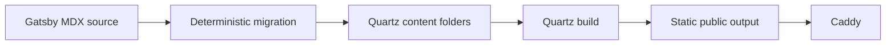

I did not move to Quartz because I wanted a blank new blog. I already had years of posts, working URLs, images stored beside articles, and a publishing order that made sense to me. The challenge was to keep all of that while taking advantage of Quartz 5—and to customize the result without turning Quartz itself into a private fork that would be painful to upgrade.

My starting point was Quartz 5.0.0 at commit `f1fba3f`. By the end of the migration, the site still used stock Quartz core. The custom behavior lived in configuration, five small local plugins, one site stylesheet, deterministic migration scripts, and the production web-server rules.

That boundary became the most important architectural decision in the project.

## The migration was the real project

The source was not a handful of Markdown files:

- 149 numbered posts;
- 153 documents in total;
- 491 images and other article-owned assets;
- 153 historical Gatsby URLs;
- old MDX components and a small collection of content edge cases.

I wanted each post to remain a self-contained folder:

```text
124-server-certificates-nodejs/
├── index.md
└── any images owned by the article
```

I deliberately did not flatten all images into one global assets directory. Keeping an article and its images together makes ownership obvious, avoids filename-prefix schemes, and preserves the natural `../numbered-folder` relationships already present in the source.

The resulting flow is straightforward:



The simplicity of that diagram hides an important rule: the migration source is immutable. The script reads `content-original`, builds a complete manifest, and writes only migration-owned destination folders. A full regression test runs the migration twice, compares every output byte, and proves that the source did not change.

I kept the earlier Python scripts for historical reference, but they are not part of the current pipeline. One fuzzily rewrote links in place, another performed a narrow link check, and another flattened posts and assets. They were useful experiments, but not safe or complete enough to remain authorities.

## Deterministic repairs beat manual cleanup

Real content always finds the parser edge cases.

The migration now has a small, tested repair ledger. It:

- projects Gatsby frontmatter into Quartz fields and adds aliases only when needed;
- converts MDX to Markdown and rejects unknown executable components;
- removes four Spotify player instances while preserving historical prose and fenced examples;
- normalizes one `react-live` fence and three malformed table separators;
- corrects one asset-case mismatch;
- documents one missing-image replacement and two genuinely unavailable images;
- repairs a few malformed links and duplicate heading anchors;
- escapes 27 prose ordinals such as `#1` that Quartz would otherwise treat as tags;
- escapes 139 currency dollar signs in six traced documents that KaTeX had mistaken for math delimiters.

The principle is narrowness. I did not apply broad search-and-replace rules to the corpus just because they made warnings disappear. Path-specific repairs state why they exist, fail if their expected input vanishes, and have regression tests.

That is how the final build reached zero Spotify embeds, zero numeric tag routes, zero LaTeX/KaTeX warnings, and zero migration errors without rewriting unrelated prose.

## URLs were part of the content

Of the 153 historical Gatsby URLs, 128 already matched the canonical Quartz path. The other 25 became aliases. I retained the physical numbered directories, including two unusual dotted names:

```text
/19.changing-gatsby-colors-manually/
/20.gatsby-theme-features/
```

Those names exposed a useful distinction. Quartz generated the right static directories and files, but its local `--serve` preview returned 404 for the clean dotted directory URLs. Production Caddy served them correctly.

The final Caddy lookup is conceptually:

```text
{path}
{path}.html
{path}/index.html
```

There is also a narrow rule for an old alias requested with a trailing slash. If—and only if—a sibling alias `.html` file exists, Caddy redirects to the slashless alias first. Canonical directories keep their trailing slash, queries survive the server redirect, and dotted assets remain ordinary static files.

One deployment caveat is easy to forget: the current development Dockerfile still runs `npx quartz build --serve`. It does not package Caddy. The Caddyfile defines the approved production static-serving behavior, but wiring it into a final image is a separate deployment task.

## Post numbers and dates mean different things

The leading post number is the site's chronology. It controls:

- Latest Articles;
- the main Blog list;
- Previous and Next.

Frontmatter dates control something else:

- the date displayed to readers;
- membership in a year archive;
- ordering inside that year.

The two orders materially diverge in the historical corpus. Treating the date as the universal order would silently change how the site is read. Treating the number as a year key would make the archives wrong.

I put the numeric comparator in one shared helper and reuse it from the homepage list, Blog, and Previous/Next. Year pages are derived from frontmatter dates and do not require reorganizing the content folders.

## I made page classes explicit

Quartz has native page types and layout slots. I added a small site-level classification layer on top:

```text
home
numbered article
T.I.L
static page
archive
topic/tag
other
```

That lets the components follow the content instead of appearing everywhere.

The global header contains the geometric mark, `bobby_dreamer`, Blog, Topics, T.I.L, iRevere, About, Search, and Theme. Explorer and the old Cheats link are not part of the current navigation.

A numbered article is composed like this:

```text
Header
Breadcrumb
Article title
Tag pills
Date + read time
Conditional Table of Contents
Article content
Backlinks
Previous / Next
Footer
```

T.I.L uses article-like content layout but intentionally has no article metadata, Previous/Next, or Graph. Blog, year archives, and Topics are generated virtual pages. Native tag pages still handle the complete tag index and per-tag listings.

Five local packages implement the pieces that configuration alone could not express:

- the header;
- numbered/T.I.L page matching;
- Blog, year, Topics, and compatibility pages;
- article tag placement;
- numeric Previous/Next.

Their TypeScript is the source. Their `dist` JavaScript is generated because Quartz loads them as packages. This is a small detail that matters during maintenance: editing only the TypeScript or only `dist` creates a site whose inspected source and actual runtime disagree.

## Blog descriptions and article metadata have different jobs

On Blog, every row shows:

```text
title
description
date
```

Inside an article, repeating the description in a Properties card did not help. The current article header is deliberately simpler:

```text
Article title
#tag-one  #tag-two
Jan 02, 2022, 9 min read
--------------------------------
Article content
```

The description is not deleted. It still supports Blog, document metadata, Open Graph, and other discovery consumers. Two older posts do not have an explicit description field; Quartz derives one from their prose, so the current Blog still renders 149 descriptions for 149 articles.

The tags use Quartz's existing Tag List and pill design. There is a slightly surprising implementation detail: directly registering the community Tag List in Quartz 5.0.0 caused the component registry to replace Theme with an extra tag list. I kept a tiny local wrapper in the existing article-metadata slot instead. It is the kind of workaround I want to re-test—and possibly delete—during the next Quartz upgrade.

## Table of Contents: the exact rule matters

I inspected the installed implementation instead of assuming the documentation told the whole story.

The current rule is:

```text
Eligible headings: H1, H2, H3
Excluded headings: H4, H5, H6
Configured minimum: 1
Implementation comparison: toc.length > minEntries
Effective minimum: 2 eligible headings
Page class: numbered articles only
```

That strict greater-than comparison is why an article with one eligible heading does not get a trivial TOC.

The corpus audit currently expects 53 TOCs and finds 53, with no missing or unexpected panels. The better long-term invariant is not “there must always be 53.” It is “every article that meets the rule gets exactly one, and every article below the threshold gets none.” Publishing another post should be allowed to change the snapshot.

## The Graph became useful after I moved it

The original Graph View was on T.I.L. T.I.L has no graph-resolvable content links or tags, so the local graph was essentially one node.

I removed it from T.I.L and placed the native Quartz Graph after the homepage's Working on section. It uses site-wide depth, includes tag relationships, supports drag and zoom, and has enough width and height to function as a discovery tool rather than a narrow sidebar card.

The Phase 4C audit recorded 220 nodes, 202 content edges, and 310 tag edges. The homepage itself now contributes eight authored links too, so future graph reports should say whether those are included in the content-edge total rather than comparing an unlabeled number.

On mobile, the graph becomes 18rem high, stays within the content width, and drops the large card shadow.

## Designing the identity and typography in the browser

The visual system uses a warm paper-like light theme and a warm charcoal dark theme. Schibsted Grotesk handles titles and headings, Source Sans Pro handles body copy, and IBM Plex Mono handles code and the `bobby_dreamer` wordmark.

The current selected scale is exact:

| Element            |  Desktop/tablet |        Mobile |
| ------------------ | --------------: | ------------: |
| Page title         |   2.5rem / 40px |   2rem / 32px |
| Primary navigation | 1.2rem / 19.2px |          same |
| Homepage greeting  | 1.7rem / 27.2px |          same |
| Site identity      |     3rem / 48px |   2rem / 32px |
| Geometric mark     |   0.75em / 36px | 0.75em / 24px |

The identity briefly existed at the initially requested 4rem. Rendered review showed that it dominated the page, so it was refined to 3rem desktop and 2rem mobile. That is a useful reminder that a mathematically precise token still needs browser validation.

Another title problem was less subjective. Article titles had an artificial `max-width: 21ch`, so “Calling NodeJS Functions from external files” wrapped on a desktop even though its containing block had plenty of room. I removed the maximum instead of shrinking the font or forcing `nowrap`.

The rule is now simple: a title is 2.5rem on desktop, uses the available article heading width, and wraps naturally when the real layout requires it.

## What I removed from default Quartz

Customization is also subtraction.

- Explorer was removed; the header, Blog, Topics, Search, and Previous/Next cover the current navigation model.
- Reader Mode and the generic Page Title component are disabled.
- Properties is not rendered.
- The direct Tag List registration is disabled in favor of the wrapper described above.
- Spotify playback is removed at migration time.
- The old Cheats navigation idea was rejected because the route and taxonomy did not exist coherently.

I kept native functionality where it fit: Search, Theme, tag pages, Backlinks, TOC, Graph, content index, syntax highlighting, Obsidian Markdown features, KaTeX, Excalidraw, aliases, favicon, Open Graph, and the ordinary content/folder/tag emitters.

## How I test the site

The current baseline is 199 tests across 45 suites. The custom tests cover migration, routes, numeric chronology, year membership, page classes, header assets, typography tokens, Graph placement, article metadata, and the tag wrapper.

The rest of the validation is layered:

1. TypeScript and Prettier.
2. A production Quartz build.
3. Migration preflight against the immutable source.
4. Generated-site validation for documents, assets, aliases, links, fragments, branding, numeric tags, and Spotify.
5. A dedicated TOC audit.
6. Caddy validation and a route matrix, especially dotted folders and aliases.
7. Browser checks at 1440×900, 900×900, and 390×844 in light and dark modes.

At the browser layer I check more than screenshots: computed font sizes, title width and line count, Search and Theme interaction, header collisions, clipped text, console errors, and page-level horizontal overflow.

The current corpus snapshot is useful:

```text
153 migrated documents
149 numbered posts
491 source-owned assets
25 aliases
53 expected / 53 rendered TOCs
149 Blog titles, dates, and descriptions
149 article tag lists
0 Properties panels
0 numeric tag routes
0 Spotify embeds
0 migration errors
```

But the structural statements matter more. When post 150 is published, a good test suite should not fail merely because 149 changed. It should prove that post 150 appears once in Blog, lands in the right year, participates in numeric navigation, renders its tags correctly, and receives a TOC only if it qualifies.

## How I plan to upgrade Quartz next time

I now have a `CUSTOMIZATIONS.md` with stable IDs for every major behavior and a smaller machine-readable manifest. The next upgrade should start there, not with broad repository rediscovery.

The process will be:

1. record the current baseline;
2. compare the old upstream commit to the target release separately from the site customization diff;
3. map changed Quartz APIs, classes, and defaults to the affected customization IDs;
4. look for native replacements;
5. port local source and rebuild generated package output;
6. run the full automated, generated-site, Caddy, and browser matrices;
7. update the architecture documentation before merging.

I do not want to preserve custom code just because I wrote it. If a future Quartz version provides Blog archives, conditional composition, Previous/Next, curated topics, or a Tag List registration that exactly meets the requirement, I would rather use the supported native feature.

The other half of the policy is equally important: I will not silently accept changed behavior merely to make the diff smaller.

## Things I learned

- Treat URLs, asset ownership, and chronology as content requirements, not implementation trivia.
- Keep migration exceptions narrow, named, and tested.
- Separate numeric reading order from calendar dates when the source uses both.
- Prefer local plugins and configuration to core patches, but document every internal API they touch.
- Generated plugin files need a clear source/rebuild rule.
- A preview server is not proof of production routing.
- A Properties panel can contain valid data and still be the wrong presentation.
- A graph needs a useful scope and location, not merely a place in the layout.
- Responsive browser review can legitimately refine an exact design request.
- Snapshot counts are evidence; structural invariants are the long-term contract.

Quartz turned out to be customizable enough for this site without a core fork. The cost of that flexibility is not primarily code. It is maintaining a clear boundary between stock behavior, local behavior, migrated content, and production serving—and keeping enough evidence that the next upgrade does not require learning the same lessons again.

* * * 