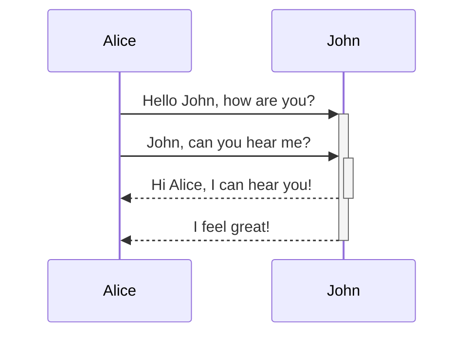

## Headings
---

# Heading 1
## Heading 2
### Heading 3
#### Heading 4


## Internal Links
---

Linking to internal links
* default: link name same as filename, .md is in different folder - `[[paths]]` - [[paths]]
* Like markdown but path is not mentioned - `[omam for gastric](142-omam-for-gastric.md)` - [omam for gastric](142-omam-for-gastric.md)
* Like markdown, so link has different name and no extension(.md) - `[Architecture](architecture)` - [Architecture](architecture)
* Changing the name of the link - `[[making plugins\|Making Plugins]]` - [[making plugins\|Making Plugins]]

## Folders / Tags
---

* Link to a folder : [[advanced/]]

## Callouts
---

There are 12 types of callouts, check `docs/features/callouts`

> [!info]
> Default title

> [!question]+ Can callouts be _nested_?
>
> > [!todo]- Yes!, they can. And collapsed!
> >
> > > [!example] You can even use multiple layers of nesting.

> [!note]
> Aliases: "note"

> [!abstract]
> Aliases: "abstract", "summary", "tldr"

> [!info]
> Aliases: "info"

> [!todo]
> Aliases: "todo"

> [!tip]
> Aliases: "tip", "hint", "important"

> [!success]
> Aliases: "success", "check", "done"

> [!question]
> Aliases: "question", "help", "faq"

> [!warning]
> Aliases: "warning", "attention", "caution"

> [!failure]
> Aliases: "failure", "missing", "fail"

> [!danger]
> Aliases: "danger", "error"

> [!bug]
> Aliases: "bug"

> [!example]
> Aliases: "example"

Checkbox in callouts
>[!example] Practice questions
> - [ ] [110. Balanced Binary Tree](https://leetcode.cn/problems/balanced-binary-tree/)

Collapsable Callouts
> [!example]- Lingvujo
> The [[Lingvujo]] ("language container" in Esperanto) is the part of the Notkesto where I document my linguistics projects, like [[Constructed Language|conlangs]] or writing system adaptations. I have a passion for linguistics and language learning, so projects like these are a way to get my hands a bit more dirty with language, so to speak.
>
> Currently, my only project is [[Jangul]], an adaptation of the Korean writing system for Spanish.
>
> [[Languages|Go here if you want to get started on everything language-related in the Notkesto]] (the **🦜 Langs** link above).

> [!quote]
> Aliases: "quote", "cite"

custom callouts
> [!archive]
> This page can be outdated

Code in callouts
>[!code]
> ```java
> /* Right Rotation */
> TreeNode rightRotate(TreeNode node) {
>   TreeNode child = node.left;
>   TreeNode grandChild = child.right;
>   // Right rotate the node to its right child node
>   child.right = node;
>   node.left = grandChild;
>   // Update the height of the node and the child node(the parent node after right rotation)
>   updateHeight(node);
>   updateHeight(child);
>   // Return the child node 
>   return child;
> }
> ```


## Code tags
---
Inline highlights
```
This is an array `[1, 2, 3]{:js}` of numbers 1 through 3.
```
Output: This is an array `[1, 2, 3]{:js}` of numbers 1 through 3.


Java code highlight with line and word highlighting
```java {5-7,2} /int/
/* AVL Tree Node Definition */
class TreeNode {
  public int val; // Node value
  public int height; // Node height, default 0
  public TreeNode left; // left child node, default null node
  public TreeNode right; // right child node, default null node
  public TreeNode(int x) {
    val = x;
  }
}
```

Python code with title with specific line number start `showLineNumbers{30}`
```python title="12.Python/testing/main.py" showLineNumbers{30}
# Example usage
if __name__ == "__main__":
    base_folder = "./content-original/posts"  # Replace with the base folder containing .mdx files in subfolders
    missing = scan_mdx_files_in_subfolders(base_folder)

    if missing:
        print("The following referenced folders are missing:")
        for entry in missing:
            print(f"In file: {entry['mdx_file']}, Missing folder: {entry['missing_folder']}")
    else:
        print("All referenced folders exist.")
```

## Custom CSS
---
This wrapper CSS is added in `\quartz\styles\custom.scss`

<div class="onecompilerCode-wrapper">
  <iframe class="onecompilerCode" frameBorder="0" 
  src="https://onecompiler.com/embed/java/42auj4tj9?codeChangeEvent=true&theme=dark&hideLanguageSelection=true&hideNew=true&hideNewFileOption=true&availableLanguages=true&hideTitle=true" 
  ></iframe>
</div>
 
## Mermaid diagram
---
````

````

Output:


